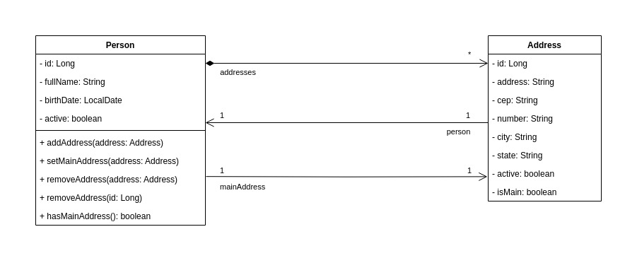

# API de Gerenciamento de Pessoas

## Sobre
Uma API REST para gerenciamento de pessoas que permite o cadastro, edição e consulta de pessoas e seus endereços.  
O projeto busca os seguintes objetivos:

* Cobertura de no mínimo 80% de testes;
* Respeitar boas práticas de programação;
    * Clean Code
    * SOLID
    * Design Patterns
    * TDD
* Seguir os princípios da Arquitetura REST;
* Documentação no padrão OpenAPI (Swagger).

### Documentação da API
**Interface:** `/swagger-ui/index.html`  
**JSON:** `/v3/api-docs`  

### Como Executar
O projeto foi desenvolvido utilizando **Java 21** e **Gradle 8.7**.  
Para inicializar a aplicação, basta executar o comando `gradle bootRun` na pasta raiz do projeto.  
A aplicação estará disponível a partir do endpoint base `http://localhost:8080`.

## AWS
O projeto foi atualizado para ser deployado na AWS.
Para tal, foi utilizado o AWS CDK para a construção da infraestrutura necessária para o deploy da aplicação.
A infraestrutura consiste em:
* Um banco de dados RDS MySQL;
* Um cluster ECS Fargate para a execução da aplicação, configurado para ter duas tasks em execução;
* Um Application Load Balancer para roteamento do tráfego para o cluster ECS.

## Deploy
No diretório _cdk_project_ há um projeto AWS CDK para deploy da aplicação na AWS.
Considerando um ambiente com o AWS CLI e o AWS CDK já corretamente configurados, basta ir no terminal e executar o comando `cdk deploy --parameters databasePass=<senhaDoRDS> --parameters databaseAdminUserName=<nomeParaUsuarioAdmin> --parameters springProfilesActive=prod` para realizar o deploy da aplicação na AWS.
No comando acima, é **obrigatório** definir o valor dos parâmetros `databasePass`, `databaseAdminUserName`, respectivamente a senha e o usuário da instância do banco RDS que será criado.

## Arquitetura do Projeto (Pacotes)
O projeto utiliza uma arquitetura em camadas particionada por capacidades técnicas (_technical-partitioned_), adequado para o porte do projeto.  
Cada camada no particionamento por capacidades técnicas possui características técnicas coesas. Por exemplo, tudo que estiver na camada “controller” estará responsável pela interação com os clientes da API, enquanto a camada “domain” foca no domínio e nas regras de negócio.

### controller
Típicas classes de controller que fazem a linha de frente de interação com os clientes da API.  

#### Subpacotes:
* dto: Classes para transferência de dados, tanto requisição quanto resposta.  
* exception: Classes relacionadas à exceção e tratamento de exceções dos controllers.  
* hateoas: Classes relacionadas à construção dos hyperlinks de cada entidade.

### domain
Pacote que contém tudo relacionado ao domínio do problema.  

#### Subpacotes:  
* usecase: Casos de uso do sistema. As classes neste pacote interagem apenas com as entidades do domínio e os repositórios.
* entity: Entidades do domínio.
* repository: Interfaces responsáveis pela interação com banco de dados.
* exception: Exceções relacionadas à regra de negócio.
* validator: Classes para validações relacionadas ao domínio do problema.

### integration
Classes para interação com serviços externos, como para a consulta de informações.  

### mapper
Utilitários para mapeamento entre objetos de diferentes tipos.  

### config
Classes de configuração, principalmente relacionadas às bibliotecas utilizadas.  

## Diagrama de Classes de Domínio

## Tecnologias Utilizadas
* Java
* Spring Boot
* Gradle
* JUnit
* Mockito
* Spring Data JPA
* Spring HATEOAS
* Hibernate Validator
* Springdoc
* H2 Database
* MapStruct
* Gson
